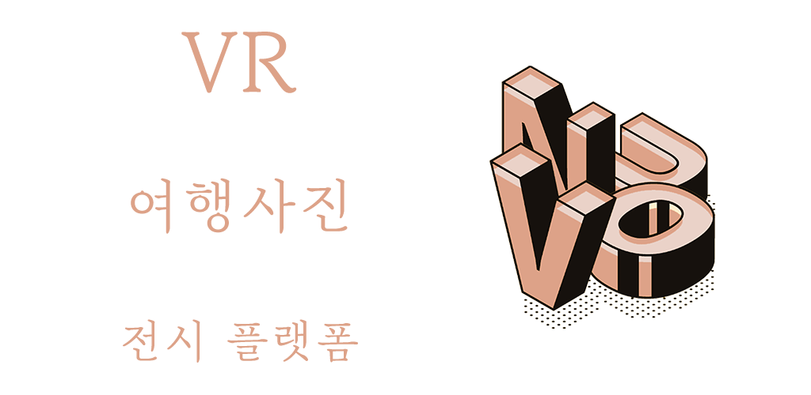
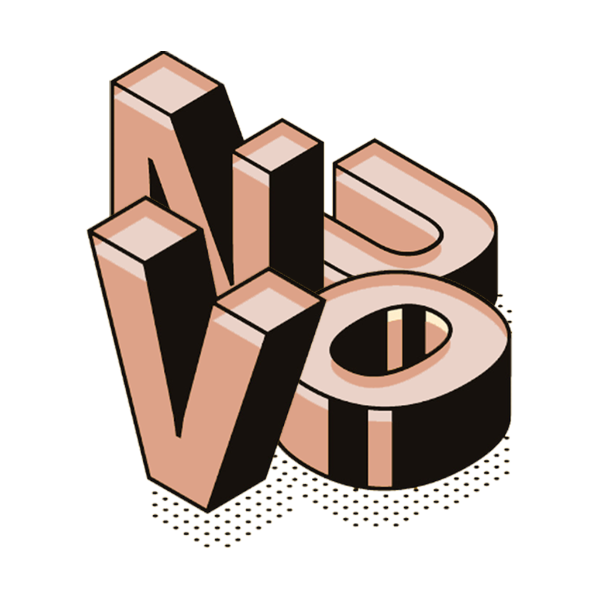

<!-- PROJECT LOGO -->
<br />

<p align="center">
    

  <h3 align="center">VR Travel Gallery Project</h3>

  <p align="center">
    Virtual Reality + Travel Photo Gallery
    <br />
    <a href="https://github.com/othneildrew/Best-README-Template"><strong>Explore the docs »</strong></a>
    <br />
    <br />
    <a href="./docs/README.md">View Demo</a>
    ·
    <a href="http://i4d110.p.ssafy.io/">Go to webpage</a>
  </p>

</p>

{:toc}

# :framed_picture: NUVO : VR 여행 사진 전시 플랫폼 :framed_picture:

## NUVO란?



20세기 초, 유럽의 일부 예술가들은 전통적인 고전주의적 미술 양식에서 탈피해 새로운 방식의 미술을 탐구했습니다. '새로운 예술(Art Nouvueau)'이라고 불리는 이러한 예술 양식은 대중들에게 신선한 충격을 주었으나 20세기의 거대한 산업혁명 물결에 금방 매몰되고 말았습니다. 우리는 이들의 정신을 계승하여, 포스트 모더니즘 시대에 사람들이 예술을 접하는 방식을 혁신합니다.

#### 시대의 새로운 예술, 그것이 우리 'NUVO'의 철학입니다.

### 기획 배경

처음엔 여행을 직접 가지 못하는 사람들을 위해, 지금까지 갔었던 추억 속의 여행장소를 공유하는 서비스를 만들려고 했습니다. 하지만 추억 속의 장소를 공유하는 것은 다른 관점에서 보면 전시의 느낌을 받았고, "여행 사진을 통해 전시회를 열면 어떨까?"라는 의견이 나왔습니다.

하지만 사진만 보여주는 디지털 전시회는 일반 사진을 보여주는 사이트와 차별점이 없었고, 저희 팀만의 특별한 차별점을 주고 싶었습니다. 그렇게 현실의 전시회를 간듯한 느낌을 주기 위해 VR을 이용하기로 했고, VR 여행 사진 전시 플랫폼을 기획하게 되었습니다.

### 기술 스택

### VR 3D 전시관 설계

### 흐름 설계

## 시작 방법

### 사전 설치

> 프로젝트를 정상적으로 실행하기 위해선 아래 프로그램들이 설치되어 있어야 합니다

- node.js
- java
- vue
- yarn
- mysql

### 준비하기

1. Git clone 받기

```
git clone https://lab.ssafy.com/s04-webmobile2-sub3/s04p13d110.git
```

2. [Backend] 데이터베이스 스키마 설정

   > 스키마 이름을 다르게 하고 싶다면 application.yml 파일도 함께 수정해야합니다

```
CREATE SCHEMA `yacht`;
```

- roles 테이블에 아래 3줄을 입력해 줍니다

```
INSERT INTO roles(name) VALUES('ROLE_USER');
INSERT INTO roles(name) VALUES('ROLE_MODERATOR');
INSERT INTO roles(name) VALUES('ROLE_ADMIN');
```

3. [Backend] application.yml 설정

- mysql 도메인과 포트번호 작성(예, localhost:3306)
- mysql 사용자 이름/비번 = 마음대로 쓰시면 됩니다
- jps 관련 설정(그대로 사용)
- multipart = 파일 업로드 관련 설정(그대로 사용)
- 이메일 인증을 위한 구글 SMTP 설정
- JWT 토큰을 위한 비밀번호, 만료시간 설정

```
spring:
  datasource:
    driver-class-name: com.mysql.cj.jdbc.Driver
    url: jdbc:mysql://{도메인주소}:{포트번호}/yacht?characterEncoding=UTF-8&serverTimezone=UTC
    username: {데이터베이스 계정 아이디}
    password: {데이터베이스 계정 비번}
  jpa:
    hibernate:
      ddl-auto: update
    show-sql: true
    properties:
      hibernate:
        format_sql: true

  servlet:
    multipart:
      max-file-size: 50MB
      max-request-size: 50MB


  # email 인증
  mail:
    host: smtp.gmail.com
    port: 587
    username: {이메일 주소}
    password: {비밀번호 토큰값}
    properties:
      mail:
        smtp:
          auth: true
          timeout: 5000
          starttls:
            enable: true


# JWT 속성
yacht:
  app:
    jwtSecret: yachtSecretKey
    jwtExpirationMs: 86400000
```

4. [Frontend] 패키지 다운로드

```
# frontend 폴더로 이동해서 다운
cd frontend/
yarn install
```

5. [Backend] (Option) Spring boot를 build(war 파일 생성)

```
# backend 폴더로 이동해서
cd backend/
gradlew -DskipTests=true build
```

### 실행하기

1. 백엔드 실행

- 생성한 war 파일 실행

```
java -jar [filename].war
```

- 혹은 war 파일 생성하지 않고 demon으로 로컬에서 실행하고 싶다면 STS와 같은 IDEA에서 Spring boot Run을 실행하거나 아래 명령어를 통해 실행

```
gradle bootRun
```

2. 프론트엔드 실행

```
yarn serve
```

```cmd
cd backend
gradle bootRun
cd ../frontend
yarn install
yarn serve
```

### 배포하기

해당 서비스는 AWS EC2를 통해 배포하였고
Docker와 Jenkins를 이용해 CI/CD 구축하였습니다:

1. AWS EC2 인스턴스 생성 (ubuntu)
2. docker 설치
3. 필요한 이미지를 docker hub를 통해 설치
   3-1. Jenkins
   3-2. MySQL

4. Jenkins와 Git
5. MySQL 컨테이너에 `yacht` DB 스키마 생성

DB 설치 (해당 프로젝트에서 MySQL 사용)
gradle wrapper을 위한 버전 설정 (6.0.0 이상)
gradle clean build 실행 (war 파일 생성)
yarn build (dist 폴더 생성)
Nginx (front-end, back-end 경로 설정)

## 👥 팀 구성 및 소개

주말에는 쉬면서 개발합니다 ㅎㅎ


### 팀장

**김동걸 팀장** [Backend 개발]

### 팀원

**장민호 개발자** [Frontend 개발]

**김태진 개발자** [Backend 개발]

**구태완 개발자** [Frontend 개발]

**권소진 개발자** [UI/UX design]

---

## 그 밖에...

### 로고

- 아이콘 로고



- 가로 로고


### PPT

- <a href="./docs/NUVO 중간 기획.pdf">중간 기획 PDF</a>
- <a href="./docs/NUVO 최종 발표.pdf">최종 발표 PDF</a>

### 동영상

- <a href="https://youtu.be/IcBUw3QvmY8">팀 소개 영상 바로가기</a>
- <a href="https://youtu.be/l8EDliCau-E">UCC 영상 바로가기</a>
- <a href="https://youtu.be/8f37NpMiJFU">시연 영상 바로가기</a>
- <a href="https://youtu.be/VROylxUa4Ks">종합 영상 바로가기</a>

<!-- ACKNOWLEDGEMENTS -->

## Acknowledgements

- [GitHub Emoji Cheat Sheet](https://www.webpagefx.com/tools/emoji-cheat-sheet)
- [Img Shields](https://shields.io)
- [Font Awesome](https://fontawesome.com)
- [Animate.css](https://daneden.github.io/animate.css)
- [sweetalert2](https://sweetalert2.github.io/)
- [A-frame](https://aframe.io/)

<!-- MARKDOWN LINKS & IMAGES -->
<!-- https://www.markdownguide.org/basic-syntax/#reference-style-links -->
