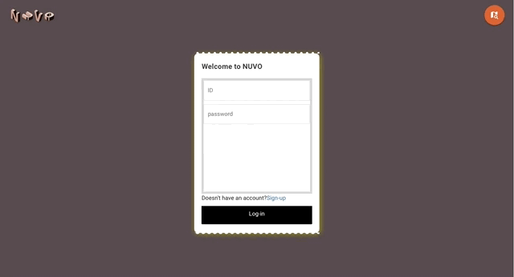

# Demo

## Home 화면

- 각 버튼에 mouse hover에 따른 애니메이션 적용

## Navbar 애니메이션

- 사운드 효과와 백그라운드 애니메이션 적용

## Main 화면

> 사용자에게 새로운 재미와 세계 지도를 따라 여행 다니는 느낌을 주기 위한 worldmap view 화면과 검색을 통해 빠르게 원하는 결과를 보여주기 위한 list view 화면

### Worldmap view

- 대륙 marker에 마우스 hover시 비행기가 날아오는 애니메이션 적용

- 처음 방문하는 사용자의 편의를 위한 Tips 기능

### List view

- 검색어 필터링

- 태그 필터링

## Login 화면

- 표를 끊고 입장하는 듯한 느낌을 주기 위해 티켓 느낌의 UI와 애니메이션 적용

## Signup 화면
